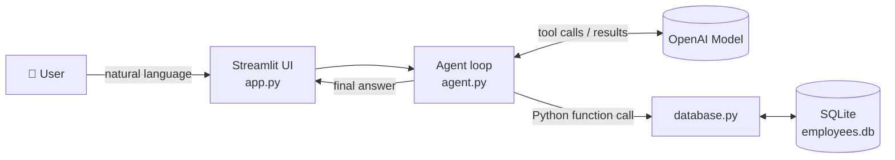

# 🤖 AI Employee Database Agent

> Manage an employee database by **talking to it**. Ask in plain English, and an AI agent turns your request into safe, structured database operations — no SQL required.


---

## 📌 Overview

**AI Employee Database Agent** is a Python application that connects a large language model to a SQLite database using **OpenAI function calling**.

Instead of writing queries like `SELECT * FROM employees WHERE city = 'Kolkata'`, you simply type:

> *"Find employees from Kolkata."*

The model decides which tool to call, your Python code executes it against the database, and the model replies in natural language.

**Key design idea:** the AI **never writes or runs raw SQL**. It can only call a fixed set of predefined, parameterized Python functions — a safer and more predictable pattern than letting an LLM generate queries.

---

## ✨ Features

- 💬 **Natural-language interface** — manage data by chatting
- 🗃️ **Full CRUD** — create, read, update, and delete employee records
- 🔎 **Flexible search** — by name, department, city, or salary range
- 📊 **Quick analytics** — total headcount and highest-paid employee
- 🧰 **12 strictly-typed tools** using OpenAI's `strict` function-calling schemas
- 🌐 **Streamlit web app** with a live employee table
- ⌨️ **Terminal mode** for quick testing
- 🔒 **Parameterized SQL** (`?` placeholders) to prevent SQL injection

---

## 🏗️ Architecture



**How a request flows:**

1. You enter a request in the UI (or terminal).
2. `ask_agent()` sends it to the model along with the list of available tools.
3. The model responds with a tool call, e.g. `search_by_city(city="Kolkata")`.
4. The matching Python function runs against SQLite and returns a result.
5. The result is fed back to the model.
6. The loop repeats until the model has no more tools to call, then returns a friendly answer.

---

## 🧰 Available Tools

| Tool | What it does |
|---|---|
| `create_employee` | Add a new employee |
| `get_employee` | Fetch one employee by ID |
| `get_all_employees` | List every employee |
| `update_employee` | Update an employee's details |
| `delete_employee` | Remove an employee by ID |
| `search_by_name` | Partial name search |
| `search_by_department` | Filter by department |
| `search_by_city` | Filter by city |
| `search_by_salary` | Filter by salary range (min–max) |
| `search_department_salary` | Employees in a department earning at least a given salary |
| `count_employees` | Total number of employees |
| `highest_salary` | Employee with the highest salary |

---

## 🗄️ Database Schema

Table: **`employees`**

| Column | Type | Constraints |
|---|---|---|
| `id` | INTEGER | Primary key, auto-increment |
| `name` | TEXT | Required |
| `email` | TEXT | Required, **unique** |
| `department` | TEXT | Required |
| `salary` | REAL | Required |
| `city` | TEXT | Required |

The table is created automatically on first run.

---

## 📁 Project Structure

```
.
├── app.py               # Streamlit web interface
├── agent.py             # Tool definitions + ask_agent() function-calling loop
├── database.py          # SQLite connection, CRUD and search functions
├── test_agent.py        # Interactive terminal chat with the agent
├── test_database.py     # Sample script to test database functions directly
├── employees.db         # SQLite database file
├── requirements.txt     # Python dependencies
├── LICENSE
└── README.md
```

---

## 🚀 Getting Started

### Prerequisites

- Python 3.10 or higher
- An [OpenAI API key](https://platform.openai.com/api-keys)


### 1. Create and activate a virtual environment

```bash
python -m venv venv
```

**Windows**
```bash
venv\Scripts\activate
```

**macOS / Linux**
```bash
source venv/bin/activate
```

### 2. Install dependencies

```bash
pip install -r requirements.txt
```

### 3. Add your API key

Create a `.env` file in the project root:

```env
OPENAI_API_KEY=your_openai_api_key_here
```

> ⚠️ Never commit your `.env` file. Make sure it is listed in `.gitignore`.

### 4. Run the app

**Web interface (recommended)**
```bash
streamlit run app.py
```
Then open the local URL shown in your terminal (usually `http://localhost:8501`).

**Terminal mode**
```bash
python test_agent.py
```
Type `exit` to quit.

---

## 💡 Example Prompts

| You say | What happens |
|---|---|
| "Show all employees." | Calls `get_all_employees` |
| "How many employees are there?" | Calls `count_employees` |
| "Find employees from Kolkata." | Calls `search_by_city` |
| "Find employees earning between 40000 and 60000." | Calls `search_by_salary` |
| "Who has the highest salary?" | Calls `highest_salary` |
| "Add Riya as a Marketing employee with salary 47000." | Calls `create_employee` (the agent will ask for any missing fields like email/city) |
| "Update employee 2 city to Mumbai." | Calls `update_employee` |
| "Delete employee 5." | Calls `delete_employee` |

---

## 🛡️ Safety Notes

- The model has **no direct database access** — it can only invoke the 12 defined functions.
- All queries use **parameterized statements**.
- The system prompt instructs the agent to **never invent employee data** and to make sure the employee is clearly identified **before any delete**.
- Emails are enforced as **unique** at the database level.

---

## 🛠️ Tech Stack

| Layer | Technology |
|---|---|
| Language | Python |
| AI | OpenAI API (Responses API + function calling) |
| Database | SQLite (`sqlite3`) |
| UI | Streamlit |
| Config | python-dotenv |

---

## 🔧 Configuration

The model name is set in `agent.py` inside `ask_agent()`. Change it to any function-calling-capable model available on your OpenAI account:

```python
response = client.responses.create(
    model="your-model-name",
    ...
)
```

---

## 🗺️ Roadmap / Ideas

- [ ] Confirmation step (button or prompt) before delete operations
- [ ] Make `update_employee` fields optional for partial updates
- [ ] Add a max-iteration limit and error handling to the agent loop
- [ ] Conversation memory across multiple turns
- [ ] Pin dependency versions in `requirements.txt`
- [ ] Unit tests with `pytest`
- [ ] Export results to CSV / Excel
- [ ] Docker support

---

## 🤝 Contributing

Suggestions and improvements are welcome. Fork the repo, create a feature branch, and open a pull request.

---

## 📄 License

This project is licensed under the terms of the [LICENSE](LICENSE) file and is intended for educational and demonstration purposes.

---

## 👤 Author

**Tuhin Roy**
- GitHub: [@TuhinRoy07](https://github.com/TuhinRoy07)

⭐ If you found this project useful, consider giving it a star!
